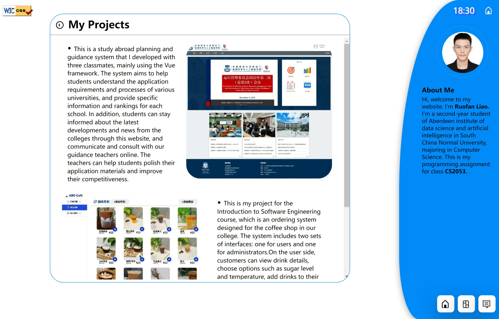

# Web-Develop-Assignment

- School:	University of Aberdeen & South China Normal University
- Major:	Computer Science
- Name:	Ruofan Liao
- Student Number:	50079732
- Github:	https://github.com/LLLLLrf/Web-Develop-Assignment

> **Contents**
> 1. [Usage](#Usage)
>
> 2. [Structure Overview](#StructureOverview)
>
> 3. [Basic Design for the Website](#BasicDesign)
>
> 4. [Innovation and Extra Work](#ExtraWork)
>
> 5. [Shortcomings and Future Plans](#Shortcomings)
>
> 6. [Reference List](#Reference)

## <span id="Usage">Usage</span>
```
cd Web-Development-Assignment/
npm start
```

## <span id="StructureOverview">Structure Overview</span>

### File Structure
<!-- codio cannot show the text version menu well, so I use image instead -->

### Web Structure


## <span id="BasicDesign">Basic design for the website</span>

### Overview of the website
This website mainly consists of four pages, **home page**, **introduction page**, **about page** and **chat application**, all tasks required in assignment have been completed and some extra work has been completed.
.
### Descriptions of each pages

#### Home Page
##### Description
This page is relatively simple, consisting of a welcome button and an animated background. I have implemented an animated background that flows like waves, when you hover the cursor over the button, the button will rotate.

##### Challenges
The biggest challenge in this page is:
1. How to make the animated background in [RootStyle.css](src/style/RootStyle.css "RootStyle.css").

After searching on the internet, I found that on a blue background, created two irregular white ellipses that were larger than the screen size by using the pseudo-elements **:before** and **:after**, and defined a looping keyframe animation to make the pseudo-elements rotate continuously. This will result in a blue wave effect.


#### Introduction Page
##### Description
This page consist of a list of cards and a navigation sidebar. By setting **border-radius** in CSS, I change the sidebar to an irregular shape. If you click on any of the cards, the webpage will navigate to the **about page** and display content and images related to the title of the card. I found that the picture resources in this page are too large, so it may takes some time to load all resources in this webpage. Thus, I made a loader to tell users the webpage is loading, please wait for a moment. 

##### Challenges
There were two main challenges I encountered in creating this page.
1. How to display different content and images on the about page when a different card is clicked
2. How to maintain the navigation sidebar across different pages after navigating between them.

For the first challenge, in [AboutMeScript.js](src/javascript/AboutMeScript.js "AboutMe.js"), I first read data from [CardsData.json](src/data/CardsData.json "CardsData.json") by asynchronous  function **getData()**, and then by using function createCardHTML(), I turn all the data read from **JSON** file into **HTML** code. By using a for loop to listen for click events on each Card, the index of the iterated item is stored in the browser's local storage using **localStorage.setItem("index", i)**. This allows the index to be retrieved on the about page using **localStorage.getItem("index")**, which can then be used to determine which Card was clicked and display the corresponding content.
```javascript
// read data from json files
async function getData(jsonName) {
    let response = await fetch(`data/${jsonName}.json`);
    let data = await response.json();
    return data;
}
```
For the second challenge, I included all the HTML code for the navigation sidebar in [SideCard.html](src/html/SideCard.html "sidebar html"), then I read it in [SideCard.js](src/javascript/SideCard.js "navigation sidebar") and then inserted it into every HTML file that imported this JS file by using the following JS code. Therefore, all that is required to display the navigation sidebar in every HTML file is to import this JS file and include a **div** element with the **id="side-card-box"** in each HTML file where the sidebar is needed.

```javascript
window.onload = function(){
    document.getElementById("side-card-box").innerHTML = `HTML BODY`
}
```


#### About Page
##### Description
This page consists of a text box and a navigation sidebar. When the content in the text box exceeds the height of the box, a scrollbar is generated. There is an arrow button located before the text title, which when clicked, takes the user back to the Introduction Page. 

##### Challenges
The biggest challenge in this page is:
1. how to display different content according to the index in local storage.

I first stored the detailed content and image to be displayed on each Card in [Contents.json](src/data/Contents.json "Contents.json"). Then, in [DetailScript.js](src/javascript/DetailScript.js "Detail Script"), I use the index from local storage to read the corresponding data in the JSON file. By using the function createContentHTML(), I generate the HTML code for the text box, then use the following JS code to involve them in the [DetailPage.html](src/html/DetailPage.html).
```javascript
   document.getElementById('title').textContent = contents[index].title;
   document.getElementById('content').innerHTML = main_content;
```


#### Chat Application
##### Description
This page is the focal point of the assignment, and I will provide a detailed explanation of its implementation method and specifics. This page consist of a chat box and a navigation sidebar, but I added a user list in the sidebar.

Firstly, let me introduce all the functions of this page. The users need to enter a username first, if you try to send message before submit a username, or try to submit an empty username, or the username already exist, the webpage will display a pop-up alert box showing a warning message. After you enter a username (length within 1 to 20), the chat box will start showing messages from other users. All messages from other users will be display on the left side, only the messages entered by yourself will be display on the right side. All users who are accessing this website will be recorded and the current number of online users will be displayed in the **"online users"** variable located in the top right corner of the chat box. The **"registered users"** variable will display the current number of users who have entered a username. After entering a username, the chat box will display a message **"\<username\> joined the chat"**, and all users' username will be displayed in the user list located in the navigation sidebar, and will automatically scroll to the bottom of the user list. Each username in the user list can be clicked, and when clicked, the username will appear in the message input box in the form of "@username". Furthermore, I will be keeping a record of all users who are typing messages in the message input box. This information will be displayed by replacing the content of the Chat Box header to show how many users are currently typing.

##### Challenges
Secondly, I will explain the challenges I encountered while creating this webpage.
1. How to receive and send user messages first, and then separate the messages sent by other users and one's own messages and place them on the two sides of the Chat Box.
2. How to display the number of users online and the number of people who have submitted a username, and show the message **"\<username\> joined the chat"** and **"\<username\> left the chat"**
3. How to monitor the real-time number of users who are currently typing. 

For the first challenge, in [ChatScript.js](src/javascript/ChatScript.js), through **express** and **socket.iO**, the client and server communicate with each other in real-time. **jQuery** listens for the form submission event of the message input box. Whenever a user submits a message form, it checks if the user has a username and if the message is not empty. If both conditions are met, it uses **socket.emit()** to send the user's message content to the server-side [index.js](index.js "index.js"). The server-side uses **users[socket.id]** to query the username of the user who sent the message and sends the username and message together to the client-side using **socket.emit()**. The client-side generates HTML tags based on the user message sent by the server-side and determines if the username matches the local username (each user's username is unique). If they match, it adds **class="message-right"** to the HTML tag, and if they don't match, it adds **class="message-left"**.

For the second challenge, I have set two variables, **numUsers** and **registerUsers**, in [index.js](index.js). Each time "io.on('connection', (socket)) => {}" is executed, **numUsers** is incremented. When a user submits their username, they emit a message to the server, which increments **registerUsers**. When a user disconnects, **numUsers** is decremented first, and then the server checks if the user has a registered username by querying their socket.id. If the user has a registered username, **registerUsers** is decremented, and the user's username and input status are deleted. This allows for recording the number of online users and the number of registered users with usernames. Finally, socket.on is used to set up a function that sends data **{numUsers, registerUsers}** to the client. By using **setInterval()** to emit a message to the server every second, the user count can be updated in real time.

For the third challenge, In [ChatScript.js](src/javascript/ChatScript.js "ChatScript.js"), I have set two variables, **previousValue** and **typeTimer**. **previousValue** is used to record the previous value of the user input box. By comparing it with the current value of the input box, we can determine whether the user has modified the input content during two consecutive queries. If there is a modification, it means that the user is currently typing. **typeTimer=setTimeout()** is used to record the time when the user stops typing. If the user does not continue to modify the content within 5 seconds, it is determined that the user has stopped typing. However, every time the user modifies the input box, the time of **typeTimer** is reset.
Then, the variable **TypingNum** is used to record the number of users currently typing. Finally, **setInterval( function(){socket.emit('typingNum')} )** was used to emit to the server, and the server will return the variable **TypingNum** every second. If it equals 0, the **"Chat Box"** will be displayed. If it is not equal to 0, it will display **"${typingNum} user typing..."**.


## <span id="ExtraWork">Innovation and Extra Work</span>
In addition to completing the requirements of the assignment, I have also done some extra work to make the website better.


1. The ***[W3C Markup Validation Service](https://validator.w3.org/#validate_by_upload)*** and ***[W3C CSS Validation Service](https://jigsaw.w3.org/css-validator/validator.html.en#validate_by_upload)*** provided by **W3C** were used to test all the HTML and CSS files in my project to ensure that there are no errors or warnings in both HTML and CSS code.

2. In [router.js](router.js), I use the router.get() method in express.Router() to set different paths to different webpages, and use module.exports to export the router to [index.js](index.js), which can provides better code organization and maintainability.

3. JSON files were used to store the content of the Introduction Page and About Page. And then I used asynchronous functions to read the data, which makes it easier to manage the data and connect to databases in the future.

4. I added a lot of CSS effects to the page, such as animations on the homepage and hover effects on buttons, to make the page more visually appealing. I used **Date()** to get the current system time and displayed it on the page.

5. In the About Page, I made a loader to let user to wait for the page to load the resources. 

6. In the Chat Application Page, users can mention other users by clicking on their names in the user list, which will insert "@username" into the input box.

7. When the messages in the Chat Box exceed the height of the box, a scroll bar will appear, and each time a new message is added, the Chat Box will automatically scroll to the bottom to display the latest message.

## <span id="Shortcomings">Shortcomings and Future Plans</span>
Even though I tried to make the page as appealing as possible both functionally and visually, the website still has a few shortcomings.

1. Although JSON is used to store data, there is no connection to any database, which limits the scale of data, makes the website less secure, and lacks good scalability.

2. For the Introduction page, there is no interface for publishing new content. If new articles need to be added, the JSON file needs to be modified, which is very inconvenient.

3. The profile picture in the navigation sidebar cannot be customized. In the future, I hope to add a feature that allows users to upload their own profile pictures, and display the username and profile picture during chats.

4. When a user is @ by others, I hope the user will receive a noticeable message that can let the user know instantly, but this function have not been realized yet.

5. The Chat Application Page can not send image, so the chat function is still not perfect now.

6. This website is not deployed to the cloud server and does not have a domain name, which is not convenient for other users to access this website


## <span id="Reference">Reference List</span>
1. https://www.w3cschool.cn/wematy/wematy-lf7y3bs4.html
This Website shows me how to write HTML, CSS, JS in a standard form.
1. https://www.php.cn/js-tutorial-413698.html
This article shows how to use JavaScript to get the current time and display it.
2. https://blog.csdn.net/weixin_44044705/article/details/106319784
I have learned how to use text-shadow in CSS3 to Implementing artistic text effect.
3. https://getcssscan.com/css-box-shadow-examples
This website provides different kinds of box shadow.
4. https://mp.weixin.qq.com/s/w1nVRSOYvBTatzoX2IzM4A
The design of the home page was inspired by this website
5. https://css.gg/app
This website provides me many svg icons
